# Explainable Multi-Class Salary Range Classification Using Machine Learning Techniques

Nama Penulis 1, Nama Penulis 2, Nama Penulis 3

Institusi Penulis

Email korespondensi

---

## Abstract

Salary prediction studies commonly formulate the task as regression to estimate exact income values. In practical human resource analytics, however, organizations often require salary grouping for decision support, such as candidate screening, compensation benchmarking, and recommendation. This study proposes an explainable multiclass salary range classification approach that transforms continuous salary values into categorical salary groups and compares machine learning models on structured salary data. The study follows a CRISP-DM pipeline covering data understanding, preprocessing, quartile-based salary discretization, modeling, evaluation, and SHAP-based explainability. The experiment uses 3,000 salary records with nine attributes and yields four balanced classes after preprocessing (n=2,993; approximately 25% per class). Three models are evaluated: Logistic Regression, XGBoost, and CatBoost. On the hold-out test set, CatBoost provides the best performance with Accuracy 0.7362, Macro F1-score 0.7357, Weighted F1-score 0.7357, and multiclass ROC-AUC 0.9224, exceeding the research target (Macro F1 >= 0.70). SHAP analysis confirms that experience level and job title are dominant predictors, followed by interaction effects, and local explanation provides feature-level contributions for individual predictions. The study contributes a practical and interpretable multiclass framework for compensation-oriented HR analytics.

**Keywords**: explainable AI, SHAP, salary classification, HR analytics, multiclass classification, CatBoost

---

## 1. Introduction

The increasing availability of workforce and job-related data has encouraged the adoption of data-driven approaches in human resource management. One of the most frequently studied tasks in this area is salary prediction, where machine learning models are used to estimate a worker's salary based on professional, educational, and occupational attributes [1], [4]. Accurate salary information is important for multiple purposes, including compensation planning, job market analysis, candidate evaluation, and career recommendation.

Most previous studies formulate salary prediction as a regression problem, where the target variable is a continuous salary value [1], [4]. Although this formulation is technically appropriate for numerical estimation, it does not always align with the practical needs of HR decision making. In many operational settings, organizations do not necessarily require an exact salary value, but rather a salary category or salary range to support benchmarking and stratified decision making. For example, HR teams may classify candidates into low, medium, high, or premium compensation groups instead of relying on precise numerical estimates.

This condition indicates that salary range classification can provide a more practical alternative to salary regression. By transforming continuous salary data into categorical ranges, the prediction problem becomes more relevant to HR analytics scenarios that require ranking, grouping, and recommendation. In addition, multiclass classification allows the use of evaluation metrics that directly assess class discrimination performance, such as macro F1-score and confusion matrix analysis.

Despite its practical relevance, salary range classification remains less discussed than regression-based salary prediction. Many studies still emphasize minimizing numerical error metrics such as Mean Absolute Error and Root Mean Squared Error, while fewer works focus on categorical salary prediction and its interpretability for HR decision support [2], [3]. Furthermore, comparative evaluation of machine learning models for this specific formulation is still valuable, particularly for tabular datasets containing mixed numerical and categorical features [6], [9].

Based on this gap, this study formulates salary prediction as a multiclass salary range classification problem and compares several machine learning models to identify the most suitable approach for HR analytics. The study also analyzes the most influential features in salary class prediction to strengthen the practical interpretation of model outputs.

The contributions of this study are as follows:

1. Reformulating salary prediction from continuous regression into multiclass salary range classification.
2. Comparing the performance of multiple machine learning models for salary range classification.
3. Identifying key features that influence salary-class prediction.
4. Integrating SHAP-based global and local explainability into the evaluation workflow.
5. Providing a practical machine learning framework for HR analytics and compensation support.

The remainder of this paper is organized as follows. Section 2 presents related work and theoretical background. Section 3 explains the research methodology. Section 4 provides the experimental results and discussion. Section 5 concludes the paper and outlines future work.

## 2. Related Work

### 2.1 Salary Prediction in Previous Studies

Salary prediction has been widely studied in labor market analytics and data-driven recruitment systems. Previous studies generally use regression-based approaches to predict exact salary values from professional attributes, work experience, education level, and job-related features [1], [4]. Regression models are attractive because salary is naturally a continuous variable, and numerical error metrics such as MAE and RMSE are straightforward to compute.

However, regression-oriented salary prediction has two practical limitations. First, exact salary estimation may be less useful in real HR workflows where grouping and categorization are more relevant than point estimation. Second, regression results are often harder to interpret in terms of operational decision classes. These limitations motivate an alternative formulation based on salary range classification.

### 2.2 Multiclass Classification for Tabular HR Data

Multiclass classification is appropriate when the target variable can be divided into several mutually exclusive categories. In the context of salary analytics, continuous salary values can be transformed into discrete ranges using interval-based or percentile-based discretization [2], [3]. This strategy enables the use of classification algorithms that are effective on structured tabular data, especially when numerical and categorical features coexist.

Tree-based ensemble methods are commonly reported as strong performers on tabular datasets because they can capture nonlinear relationships, interaction effects, and mixed feature types [6], [10], [11]. In contrast, simpler linear models are useful as baselines to evaluate whether more advanced methods provide substantial improvements.

### 2.3 Machine Learning Models for Salary Range Classification

Several machine learning algorithms are relevant to this research. Logistic Regression can serve as a baseline classifier due to its simplicity and interpretability. Random Forest and XGBoost are widely recognized for strong performance on structured tabular datasets [10]. CatBoost is particularly attractive because it is designed to handle categorical variables effectively with relatively limited preprocessing [11]. These properties make CatBoost highly relevant for salary datasets that usually contain features such as job title, company location, education level, and employment type [6].

### 2.4 Explainability in HR Analytics

Interpretability is important in HR-related machine learning applications because model predictions may influence strategic and operational decisions. Feature importance analysis and SHAP-based explanation help identify which variables contribute most to salary or income classification outcomes [7], [8], [12]. This is useful not only for technical evaluation but also for practical interpretation in HR analytics, such as understanding whether experience, education, job role, or work location plays the strongest role in salary grouping.

### 2.5 Research Gap

Based on the reviewed context, the following research gap is identified:

1. many salary prediction studies still focus primarily on regression,
2. practical multiclass salary range classification remains less emphasized,
3. comparative analysis of machine learning models for this applied formulation is still useful,
4. interpretative discussion of the factors affecting salary class prediction in HR analytics needs further attention.

More specifically, prior studies can be grouped into three streams. First, salary prediction studies commonly use regression to estimate continuous salary values [1], [4]. Second, income classification studies often rely on binary targets, which are methodologically relevant but not fully aligned with multiclass salary range prediction [7], [8]. Third, some recent works have explored salary grading, salary offer classification, or explainable income prediction [2], [3], [9], yet a practical comparative study that focuses on multiclass salary range classification for HR analytics remains limited. Therefore, this study is positioned as an applied multiclass classification study that emphasizes both predictive performance and interpretability on structured salary data.

## 3. Research Methodology

### 3.1 Research Design

This study uses an experimental quantitative design guided by the CRISP-DM framework [13]. The research development is organized into business understanding, data understanding, data preparation, modeling, evaluation, and research-output deployment stages, followed by a final conclusion synthesis. This staged design is important because each subsequent phase is only initiated after considering the results produced in the previous phase. Therefore, the research process remains iterative, traceable, and aligned with the logic of applied machine learning development.

In practical terms, the overall workflow consists of dataset selection, data understanding, target transformation, preprocessing, model training, model evaluation, feature importance analysis, and final reporting. The outputs of each phase are documented in structured textual and visual artifacts to support reproducibility and scientific reporting.

**CRISP-DM Research Pipeline**

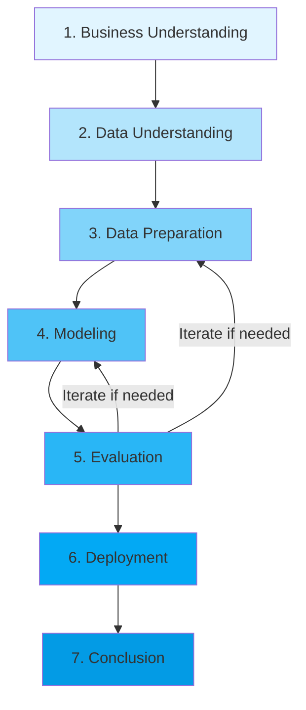

*Fig. 3.1. CRISP-DM framework applied in this study.*

### 3.2 Dataset

The study uses a publicly available salary benchmark dataset that is cleaned and standardized through the CRISP-DM data-understanding pipeline. The final dataset contains 3,000 records and 9 variables, with one target variable (`salary_in_usd`) and eight predictor features: work year, experience level, employment type, job title, employee residence, remote ratio, company location, and company size.

Dataset characteristics used in this experiment are as follows:

1. numeric fields: `work_year`, `salary_in_usd`, `remote_ratio`,
2. categorical fields: `experience_level`, `employment_type`, `job_title`, `employee_residence`, `company_location`, `company_size`,
3. salary statistics: min $12,672, median $93,574, max $480,510,
4. no missing values detected at data understanding stage.

For this study, the target variable uses `salary_in_usd` to ensure consistent salary scale for discretization. Variables that directly leak target information are excluded.

The finalized dataset used in modeling has 2,993 records after outlier filtering.

### 3.3 Salary Range Transformation

To convert the prediction task into multiclass classification, continuous salary values are discretized into four salary ranges using quartile-based grouping. The classes are defined as follows:

1. Low,
2. Medium-Low,
3. Medium-High,
4. High.

Quartile thresholds obtained from the prepared dataset are Q1 = $55,353, Q2 = $93,276, and Q3 = $143,598. Quartile-based discretization is selected because it provides a statistically grounded and balanced class distribution (749, 748, 748, 748), which is beneficial for multiclass learning and evaluation.

Formally, the discretization function is defined as:

$$
C(s) = \begin{cases}
\text{Low} & \text{if } s \leq Q_1 \\
\text{Medium-Low} & \text{if } Q_1 < s \leq Q_2 \\
\text{Medium-High} & \text{if } Q_2 < s \leq Q_3 \\
\text{High} & \text{if } s > Q_3
\end{cases}
$$

where $s$ denotes the continuous salary value, $Q_1$, $Q_2$, and $Q_3$ are the first, second (median), and third quartiles, respectively.

### 3.4 Data Preprocessing

The preprocessing stage consists of:

1. handling missing values,
2. removing duplicate records,
3. checking inconsistent entries,
4. encoding categorical features,
5. scaling numerical features if required by the model,
6. splitting the dataset into training and testing subsets using a stratified approach.

For high-cardinality categorical variables, frequency encoding or model-native categorical handling can be used. In the case of CatBoost, categorical features may be processed through the model's internal mechanism to reduce manual preprocessing.

**Data Preprocessing Pipeline**

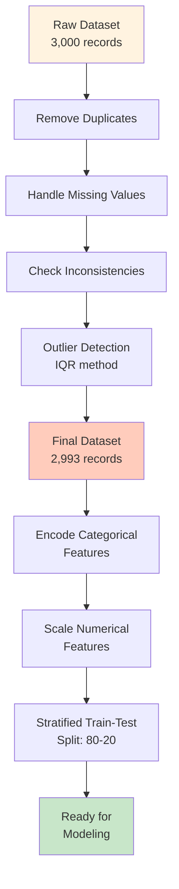

*Fig. 3.4. Data preprocessing workflow.*

### 3.5 Machine Learning Models

The models evaluated in this study are divided into baseline and main models.

#### Baseline model

1. Logistic Regression.

#### Main comparison models

1. XGBoost,
2. CatBoost.

Model configurations are tuned in the modeling phase, and all models are validated with 5-fold stratified cross-validation before final testing.

### 3.6 Evaluation Metrics

The models are evaluated using multiclass classification metrics:

1. accuracy,
2. macro F1-score,
3. weighted F1-score,
4. multiclass ROC-AUC (one-vs-rest),
5. precision and recall per class,
6. confusion matrix.

Among these metrics, macro F1-score is prioritized because it reflects balanced performance across classes and is more suitable when class frequencies are not perfectly equal. To assess robustness of model ranking, paired statistical tests (paired t-test and Wilcoxon signed-rank) are also applied on fold-level cross-validation Macro F1 scores.

**Mathematical Definitions of Evaluation Metrics**

Accuracy is the proportion of correct predictions:
$$\text{Accuracy} = \frac{TP + TN}{TP + TN + FP + FN}$$

Precision, Recall, and F1-score for each class $i$ are:
$$\text{Precision}_i = \frac{TP_i}{TP_i + FP_i}, \quad \text{Recall}_i = \frac{TP_i}{TP_i + FN_i}$$

$$\text{F1}_i = 2 \cdot \frac{\text{Precision}_i \cdot \text{Recall}_i}{\text{Precision}_i + \text{Recall}_i}$$

Macro F1-score (unweighted mean across classes) is:
$$\text{Macro F1} = \frac{1}{K} \sum_{i=1}^{K} \text{F1}_i$$

where $K = 4$ is the number of classes. Weighted F1-score accounts for class imbalance:
$$\text{Weighted F1} = \sum_{i=1}^{K} \frac{n_i}{n} \cdot \text{F1}_i$$

where $n_i$ is the number of samples in class $i$ and $n$ is the total number of samples.

### 3.7 Feature Importance Analysis

After selecting the best-performing model, feature importance analysis is conducted to identify the dominant factors in salary range prediction. Depending on the final model and implementation, the analysis may use:

1. built-in feature importance,
2. permutation importance,
3. SHAP values.

In this study, SHAP analysis is implemented on the selected best model to provide three explainability views:

1. SHAP summary plot for global feature impact distribution,
2. SHAP dependence plot for the most influential feature,
3. local SHAP explanation for representative individual prediction.

This analysis is important to connect the model findings with HR analytics insights and to increase transparency in decision support usage.
**SHAP Value Framework**

SHAP (SHapley Additive exPlanations) values are derived from cooperative game theory and provide a principled approach to feature attribution. For a given prediction $f(x)$, the SHAP value of feature $j$ for instance $i$ is:

$$\phi_j(x) = \sum_{S \subseteq F \setminus \{j\}} \frac{|S|!(|F|-|S|-1)!}{|F|!} \left[ f(S \cup \{j\}) - f(S) \right]$$

where $F$ is the set of all features, $S$ is a subset of features excluding $j$, and $f(S)$ is the model prediction given the features in set $S$.

The global SHAP importance for feature $j$ is computed as the mean absolute SHAP value across all instances:

$$I_j = \frac{1}{n} \sum_{i=1}^{n} |\phi_j(x_i)|$$

where $n$ is the number of test instances.
## 4. Results and Discussion

**Model Development and Evaluation Pipeline**

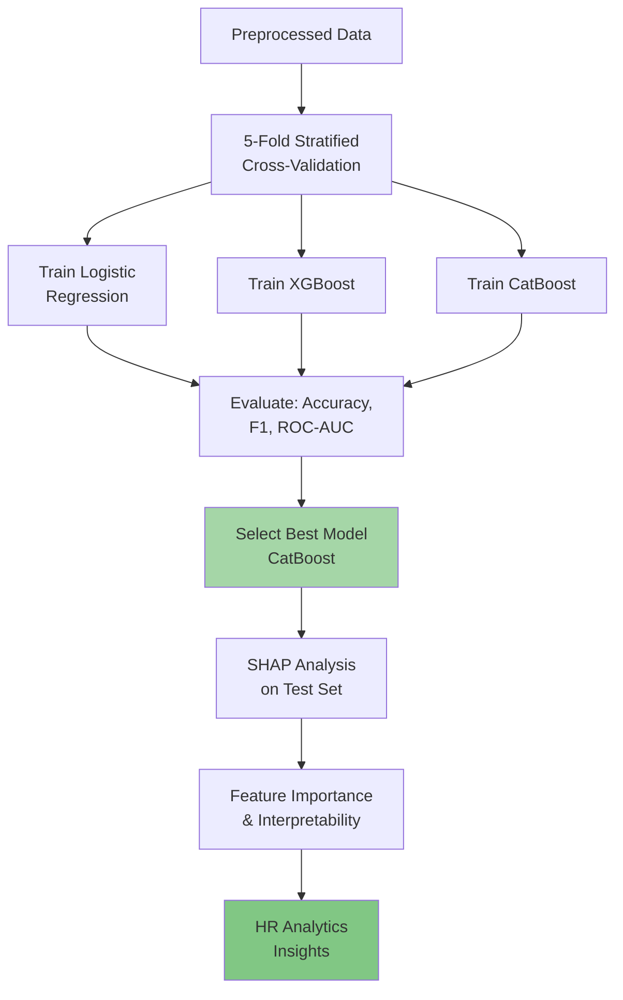

*Fig. 4.1. Model development and evaluation pipeline.*

### 4.1 Dataset Overview

The dataset overview indicates a robust tabular structure for multiclass salary classification. Initial data understanding shows 3,000 records and 9 variables with zero missing values. After IQR-based outlier filtering, 2,993 records are retained for modeling. Salary distribution is right-skewed, and quartile discretization successfully yields balanced class composition (Low: 749, Medium-Low: 748, Medium-High: 748, High: 748), which supports stable multiclass evaluation.

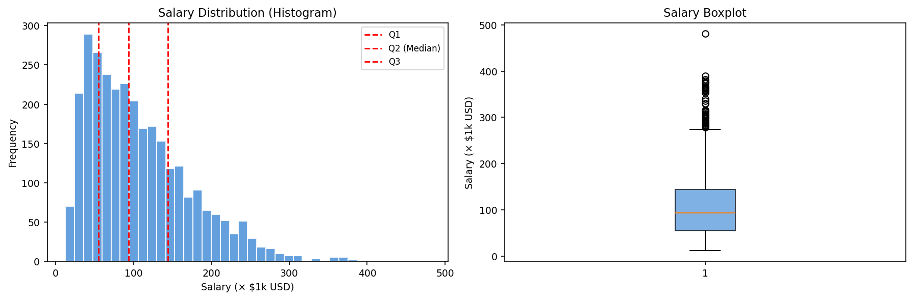

*Fig. 1. Salary distribution before discretization.*

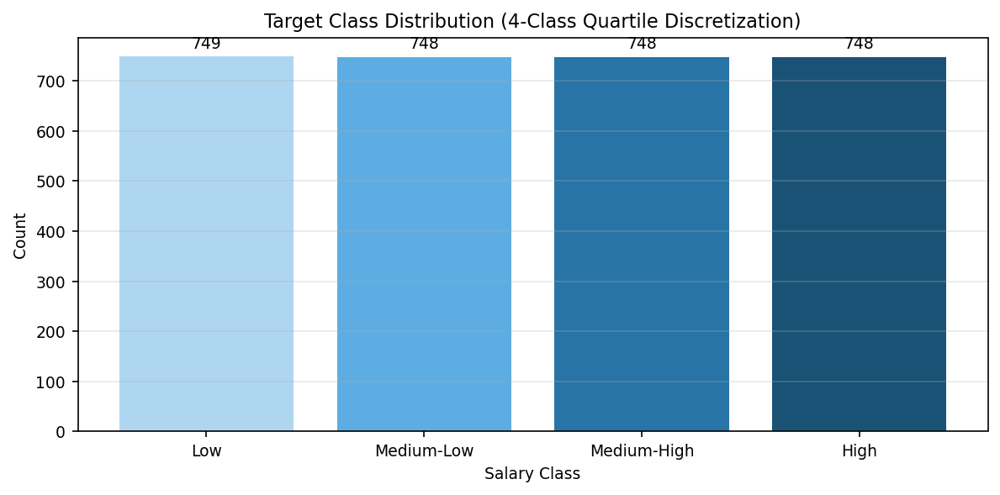

*Fig. 2. Balanced salary classes after transformation.*

### 4.2 Experimental Results

The model comparison on the hold-out test set is presented in Table 1.

*Table 1. Test-set performance comparison across models.*

| Model | Accuracy | Macro F1 | Weighted F1 | ROC-AUC | Precision | Recall | Notes |
|---|---:|---:|---:|---:|---:|---:|---|
| Logistic Regression | 0.7229 | 0.7220 | 0.7222 | 0.9131 | 0.7216 | 0.7227 | Baseline |
| XGBoost | 0.7112 | 0.7097 | 0.7098 | 0.9116 | 0.7089 | 0.7111 | Ensemble |
| CatBoost | 0.7362 | 0.7357 | 0.7357 | 0.9224 | 0.7355 | 0.7362 | Best model |

The experimental results show that all compared models pass the primary target (Macro F1 >= 0.70), with CatBoost achieving the highest Macro F1-score (0.7357). Compared with Logistic Regression (0.7220), CatBoost improves Macro F1 by 0.0137 (1.37 percentage points) and also provides the best ROC-AUC (0.9224). XGBoost is lower (0.7097). This pattern indicates that the selected feature-engineering and discretization strategy is effective, with CatBoost delivering the strongest overall trade-off.

Cross-validation results are also consistent: Logistic Regression (0.7188 +/- 0.0169), XGBoost (0.7009 +/- 0.0133), and CatBoost (0.7236 +/- 0.0216), indicating stable generalization without major overfitting.

CatBoost tuning across six parameter settings selected the best configuration at `iterations=500`, `depth=6`, `learning_rate=0.05`, and `l2_leaf_reg=3` with CV Macro F1 0.7236. An ablation test on interaction features shows a small negative delta (with interactions: 0.7236; without interactions: 0.7250; delta = -0.0013), suggesting that interaction terms are not the main source of performance gain in this dataset.

To verify whether the CatBoost advantage over Logistic Regression is statistically reliable across CV folds, paired significance tests were conducted. Both paired t-test (p = 0.2249) and Wilcoxon signed-rank (p = 0.3125) are above 0.05. Therefore, the observed advantage is directionally consistent but not statistically significant at the 5% level on this sample size.

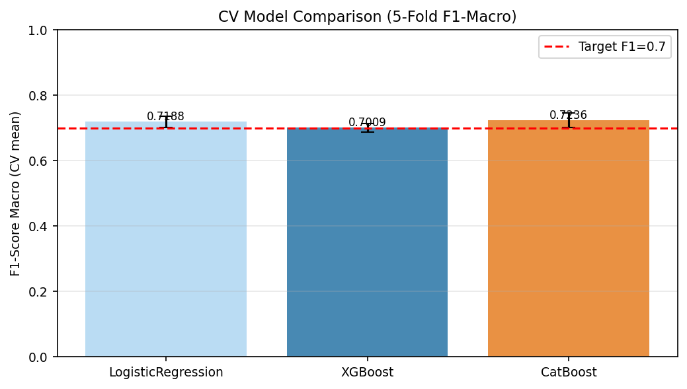

*Fig. 3. 5-fold cross-validation Macro F1 comparison.*

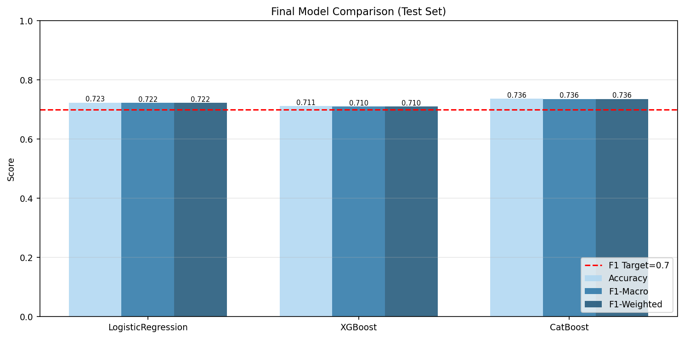

*Fig. 4. Final performance comparison on test set.*

### 4.3 Confusion Matrix Analysis

The confusion matrix confirms that the middle salary classes are the most difficult to separate. For the best model (CatBoost), class-level F1-scores are: Low 0.8389, Medium-Low 0.6954, Medium-High 0.6280, and High 0.7803. The main error pattern occurs between Medium-Low and Medium-High classes, which is expected because adjacent quartile bands often share similar profiles. In contrast, the extreme classes (Low and High) are more separable and show stronger F1 performance.

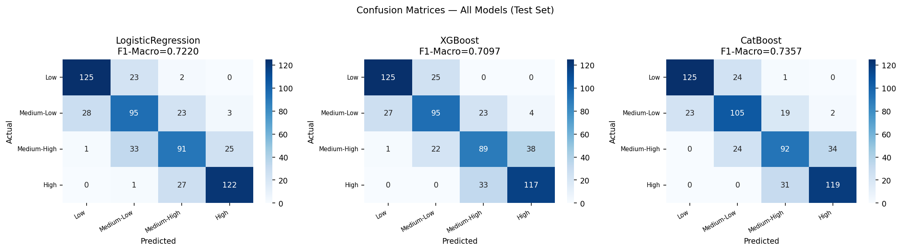

*Fig. 5. Confusion matrices on the test set.*

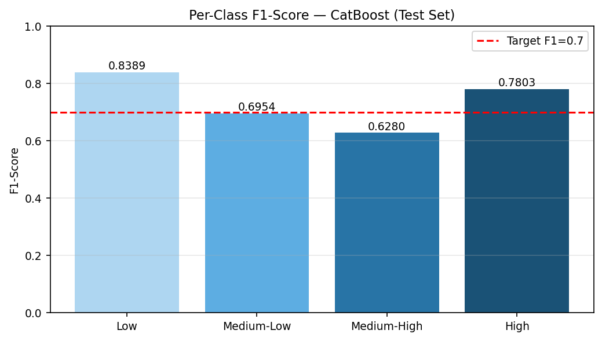

*Fig. 6. Per-class F1-score for CatBoost.*

### 4.4 Feature Importance Discussion

Feature-importance analysis shows that `experience_level` is consistently the dominant predictor across boosting models. Additional high-impact features include `job_title`, interaction features (`exp_x_job`, `exp_x_size`), and `employment_type`. This finding aligns with HR analytics literature in which seniority and role-specific specialization strongly shape compensation grouping. Company-related context and remote arrangement contribute as secondary predictors.

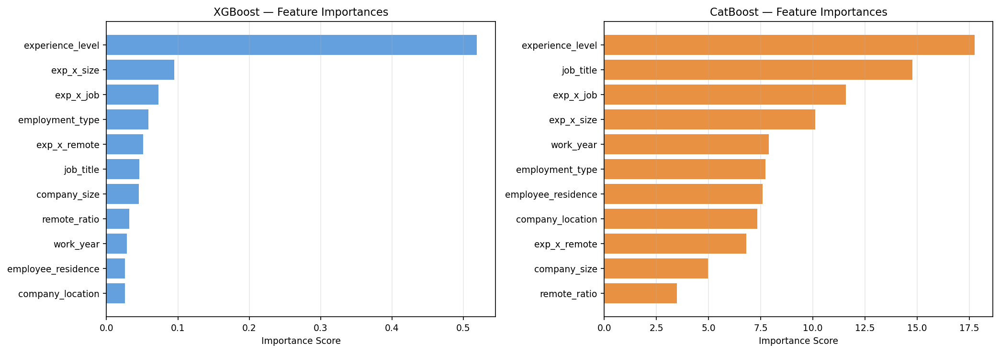

*Fig. 7. Feature-importance comparison from tree-based models.*

### 4.5 SHAP Explainability Analysis

To strengthen explainability beyond built-in feature importance, this study applies SHAP analysis on the selected best model (CatBoost). Three complementary views are provided: global summary, dependence behavior on the top feature, and local explanation for an individual prediction.

Quantitatively, global SHAP importance (mean absolute SHAP value) shows that `experience_level` (0.9637), `job_title` (0.7967), and `exp_x_size` (0.6712) are the strongest contributors for the explained High-salary class, followed by `exp_x_remote` (0.4074) and `employment_type` (0.3060). The SHAP dependence plot on `experience_level` confirms a monotonic relationship, where higher experience levels increase SHAP contributions toward the High-salary class. At the instance level (sample index 235), the local SHAP explanation indicates positive contributions from `experience_level`, `job_title`, and `work_year`, while `exp_x_size` and `exp_x_remote` provide negative offsets.

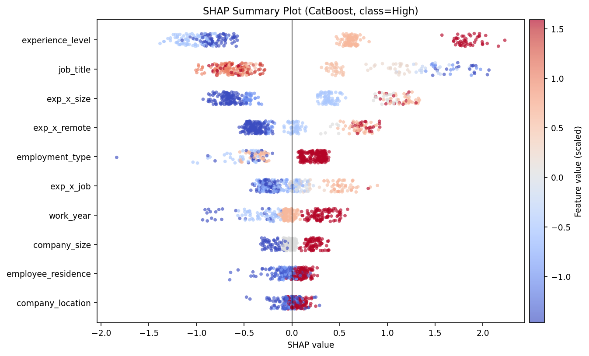

*Fig. 8. SHAP summary plot (global explanation).* 

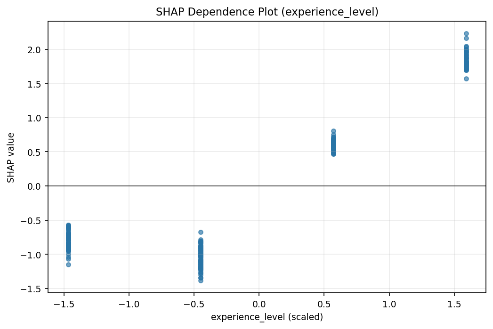

*Fig. 9. SHAP dependence plot on the most influential feature.*

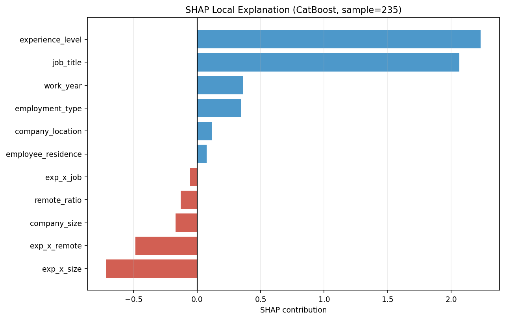

*Fig. 10. SHAP local explanation (waterfall) for one representative sample.*

### 4.6 Discussion in the Context of HR Analytics

The findings support practical HR analytics use cases where salary-band prediction is more actionable than exact salary regression. With Macro F1 above 0.73 and ROC-AUC above 0.92, the proposed multiclass pipeline can be used for preliminary candidate salary-band profiling, compensation benchmarking, and internal pay-band mapping. Stronger separability in the Low and High classes can support early screening decisions, while ambiguity in middle bands indicates that additional variables (for example, skill depth, education, and years in role) may improve boundary precision. SHAP outputs provide transparent feature-level reasoning for both global policy insight and individual-level decision justification, which strengthens explainable HR analytics deployment.

### 4.7 Research Limitations

This study has several limitations. First, although the dataset is publicly available and standardized in this pipeline, external validity across regions, industries, and time windows should be tested further with additional datasets. Second, quartile-based discretization improves class balance but reduces salary granularity because within-class variation is not preserved. Third, the most frequent misclassification remains between adjacent middle classes (Medium-Low vs Medium-High), indicating overlapping feature patterns. Fourth, CV-based significance tests indicate that CatBoost's advantage over Logistic Regression is not yet statistically significant at the 5% level, so broader data and repeated resampling are needed to confirm superiority. Fifth, performance may change with additional real-world variables such as education level, tenure, industry, and company compensation policy.

## 5. Conclusion

This study proposes and validates a multiclass salary range classification approach as a practical alternative to regression-based salary prediction in HR analytics. By transforming continuous salary values into categorical groups, the prediction task becomes more aligned with operational HR needs such as compensation benchmarking and candidate grouping. Using a CRISP-DM pipeline, three models were compared on a hold-out test set.

The final results show that CatBoost is the best model with Accuracy 0.7362, Macro F1-score 0.7357, Weighted F1-score 0.7357, and ROC-AUC 0.9224, achieving the research target (Macro F1 >= 0.70). Logistic Regression reaches competitive performance (Macro F1 0.7220), while XGBoost remains lower (0.7097). SHAP explainability analysis confirms that experience level, job title, and interaction effects are dominant drivers of salary class prediction, and provides both global and local interpretability for decision support use.

Overall, the study contributes a practical and interpretable machine learning framework for salary grouping in HR analytics, supported by predictive performance and SHAP-based explainability. Future work should validate the approach on external real-world datasets, compare alternative class-discretization schemes, and expand the explainability interface into an HR-facing decision dashboard.

## References

[1] A. Asaduzzaman, M. R. Uddin, Y. Woldeyes, and F. N. Sibai, "A novel salary prediction system using machine learning techniques," in 2024 Joint International Conference on Digital Arts, Media and Technology with ECTI Northern Section Conference on Electrical, Electronics, Computer and Telecommunications Engineering (ECTI DAMT & NCON), 2024, pp. 1-6. DOI: 10.1109/ECTIDAMTNCON60518.2024.10480058.

[2] R. Kaya, M. Saatci, and M. G. Bakal, "Improving salary offer processes with classification based machine learning models," in 2024 8th International Artificial Intelligence and Data Processing Symposium (IDAP), 2024, pp. 1-6. DOI: 10.1109/IDAP64064.2024.10710706.

[3] J.-Y. Kuo, C.-H. Liu, and H.-C. Lin, "Building graduate salary grading prediction model based on deep learning," Intelligent Automation & Soft Computing, vol. 27, no. 1, pp. 53-68, 2021. DOI: 10.32604/iasc.2021.014437.

[4] Y. T. Matbouli and S. M. Alghamdi, "Statistical machine learning regression models for salary prediction featuring economy wide activities and occupations," Information, vol. 13, no. 10, p. 495, 2022. DOI: 10.3390/info13100495.

[5] J. V. Mamidala, V. Bitkuri, and A. Attipalli, "Machine learning approaches to salary prediction in human resource payroll systems," Journal of Computer Science and Technology Studies, vol. 7, no. 10, 2025. DOI: 10.32996/jcsts.2025.7.10.52.

[6] Z. Zeng, "Enhancing data science salary prediction through CatBoost-integrated ensemble learning: A comparative study of gradient boosting methods," in 2025 International Conference on Computers, Information Processing and Advanced Education (CIPAE), 2025, pp. 1-6. DOI: 10.1109/CIPAE66821.2025.00040.

[7] M. Stow, "Explainable machine learning framework for income prediction with class imbalance optimization," International Journal of Advanced Research in Computer and Communication Engineering (IJARCCE), vol. 14, no. 8, 2025. DOI: 10.17148/IJARCCE.2025.14801.

[8] S. T. Jahan, H. B. Kibria, and M. Naeem, "Enhancing adult income prediction using PSO-tuned LightGBM and explainable AI," in 2025 International Conference on Quantum Photonics, Artificial Intelligence, and Networking (QPAIN), 2025, pp. 1-6. DOI: 10.1109/QPAIN66474.2025.11172107.

[9] W. Zita, S. Abou El Faouz, M. Alayedi, and E. E. Elsayed, "A hybrid Bayesian machine learning framework for simultaneous job title classification and salary estimation," Symmetry, vol. 17, no. 8, p. 1261, 2025. DOI: 10.3390/sym17081261.

[10] T. Chen and C. Guestrin, "XGBoost: A scalable tree boosting system," in Proceedings of the 22nd ACM SIGKDD International Conference on Knowledge Discovery and Data Mining, 2016, pp. 785-794. DOI: 10.1145/2939672.2939785.

[11] L. Prokhorenkova, G. Gusev, A. Vorobev, A. V. Dorogush, and A. Gulin, "CatBoost: Unbiased boosting with categorical features," in Advances in Neural Information Processing Systems, vol. 31, 2018. Available: https://proceedings.neurips.cc/paper/2018/hash/14491b756b3a51daac4124863285549-Abstract.html.

[12] S. M. Lundberg and S.-I. Lee, "A unified approach to interpreting model predictions," in Advances in Neural Information Processing Systems, vol. 30, 2017. Available: https://proceedings.neurips.cc/paper/2017/hash/8a20a8621978632d76c43dfd28b67767-Abstract.html.

[13] P. Chapman et al., "CRISP-DM 1.0: Step-by-step data mining guide," SPSS Inc., 2000. Available: https://www.the-modeling-agency.com/crisp-dm.pdf.