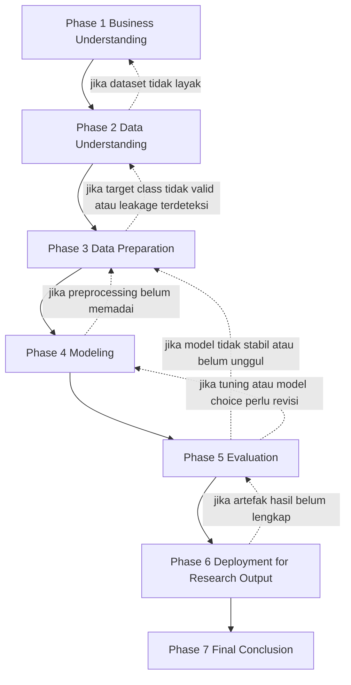

# Pipeline Penelitian Berbasis CRISP-DM

## 1. Tujuan Pipeline

Pipeline ini disusun agar pengembangan penelitian berjalan bertahap, terkontrol, dan dapat diaudit. Setiap fase CRISP-DM hanya boleh dilanjutkan jika hasil dari fase sebelumnya sudah cukup kuat. Dengan demikian, penelitian tidak berjalan linear secara buta, tetapi mengikuti logika evaluatif.

## 2. Prinsip Utama Pipeline

Prinsip yang digunakan dalam pipeline ini adalah:

1. setiap fase memiliki input, proses, output, dan keputusan lanjut,
2. setiap fase harus menghasilkan artefak yang tersimpan rapi,
3. setiap hasil fase harus didokumentasikan dalam file teks, tabel, plot, chart, dan insight jika tersedia,
4. fase berikutnya wajib memperhatikan hasil fase sebelumnya,
5. jika hasil fase sebelumnya belum memenuhi syarat, proses harus kembali ke fase yang relevan,
6. fase terakhir adalah penyusunan kesimpulan penelitian berdasarkan seluruh hasil evaluasi.

## 3. Struktur Fase

Pipeline penelitian menggunakan 6 fase inti CRISP-DM dan 1 fase akhir sintesis penelitian:

1. Business Understanding,
2. Data Understanding,
3. Data Preparation,
4. Modeling,
5. Evaluation,
6. Deployment for Research Output,
7. Final Conclusion.

## 4. Alur Dependensi Antar Fase



## 5. Standar Artefak Per Fase

Setiap fase wajib memiliki keluaran minimum berikut:

1. `tables/*.txt`
2. `plots/*`
3. `charts/*`
4. `results.txt`
5. `insights/*.txt` jika ada insight yang cukup kuat

Makna tiap artefak:

1. `tables/*.txt`: ringkasan numerik, statistik, distribusi, matriks, dan tabel hasil,
2. `plots/*`: histogram, boxplot, feature importance plot, ROC curve, confusion matrix heatmap, atau visual statistik lain,
3. `charts/*`: diagram alur, bar chart, pie chart, comparison chart, ranking chart, atau visual ringkas untuk interpretasi,
4. `results.txt`: narasi hasil utama fase tersebut,
5. `insights/*.txt`: interpretasi singkat dan keputusan riset yang diambil berdasarkan hasil.

## 6. Pipeline Detail per Fase

## Phase 1. Business Understanding

### Tujuan

Menentukan tujuan bisnis atau tujuan penelitian, rumusan masalah, hipotesis kerja, metrik keberhasilan, dan arah dataset.

### Input

1. ide penelitian,
2. rumusan masalah awal,
3. target publikasi Sinta 3,
4. kebutuhan aplikasi di domain HR analytics.

### Aktivitas

1. finalisasi formulasi masalah sebagai multiclass salary range classification,
2. finalisasi tujuan penelitian,
3. finalisasi hipotesis operasional,
4. finalisasi metrik utama dan model kandidat,
5. finalisasi kriteria dataset yang layak,
6. finalisasi definisi keberhasilan penelitian.

### Artefak yang wajib disimpan

1. `crispdm_results/phase1_business_understanding/tables/business_objectives.txt`
2. `crispdm_results/phase1_business_understanding/tables/research_questions.txt`
3. `crispdm_results/phase1_business_understanding/charts/research_flow_chart.png`
4. `crispdm_results/phase1_business_understanding/results.txt`
5. `crispdm_results/phase1_business_understanding/insights/phase1_insight.txt`

### Isi minimal results.txt

`results.txt` pada fase ini harus memuat:

1. definisi masalah akhir,
2. alasan memilih multiclass classification,
3. kriteria sukses penelitian,
4. keputusan model kandidat,
5. keputusan awal dataset.

### Syarat lanjut ke Phase 2

Hanya boleh lanjut jika:

1. formulasi penelitian sudah konsisten,
2. istilah multiclass sudah final,
3. metrik utama sudah ditetapkan,
4. kriteria dataset sudah jelas,
5. tidak ada ambiguitas pada target penelitian.

### Jika gagal memenuhi syarat

Kembali revisi tujuan, gap, atau formulasi penelitian.

## Phase 2. Data Understanding

### Tujuan

Memahami struktur, kualitas, distribusi, dan risiko dataset sebelum pemrosesan.

### Input

1. dataset kandidat,
2. keputusan dataset dari Phase 1.

### Aktivitas

1. cek ukuran dataset,
2. identifikasi tipe data,
3. analisis missing values,
4. analisis duplikasi,
5. analisis distribusi salary,
6. analisis cardinality fitur kategorikal,
7. analisis kandidat leakage,
8. analisis kelayakan salary_in_usd sebagai target.

### Artefak yang wajib disimpan

1. `crispdm_results/phase2_data_understanding/tables/dataset_overview.txt`
2. `crispdm_results/phase2_data_understanding/tables/missing_values.txt`
3. `crispdm_results/phase2_data_understanding/tables/categorical_cardinality.txt`
4. `crispdm_results/phase2_data_understanding/plots/salary_distribution.png`
5. `crispdm_results/phase2_data_understanding/plots/missing_values_plot.png`
6. `crispdm_results/phase2_data_understanding/charts/feature_type_chart.png`
7. `crispdm_results/phase2_data_understanding/results.txt`
8. `crispdm_results/phase2_data_understanding/insights/phase2_insight.txt`

### Isi minimal results.txt

1. jumlah data dan fitur,
2. daftar fitur numerik dan kategorikal,
3. kualitas data utama,
4. apakah target salary layak dipakai,
5. risiko utama pada dataset.

### Syarat lanjut ke Phase 3

Hanya boleh lanjut jika:

1. dataset utama dipilih final,
2. target salary tersedia dan valid,
3. tidak ada masalah fatal pada data,
4. leakage potensial sudah diidentifikasi,
5. struktur fitur cukup untuk modeling.

### Aturan keputusan

1. jika salary tidak valid atau tidak tersedia, kembali ke Phase 1 untuk revisi pemilihan dataset,
2. jika fitur terlalu lemah, pilih dataset lain atau ubah framing penelitian.

## Phase 3. Data Preparation

### Tujuan

Menyiapkan data final untuk modeling dan memastikan semua transformasi dapat dipertanggungjawabkan.

### Input

1. dataset final dari Phase 2,
2. hasil analisis kualitas data,
3. keputusan target dan fitur.

### Aktivitas

1. hapus duplikasi,
2. tangani missing values,
3. bentuk target empat kelas berbasis quartile,
4. keluarkan fitur yang menyebabkan leakage,
5. encoding fitur kategorikal,
6. scaling untuk model yang memerlukan,
7. stratified train-test split,
8. validasi distribusi kelas akhir,
9. dokumentasi pipeline preprocessing.

### Artefak yang wajib disimpan

1. `crispdm_results/phase3_data_preparation/tables/preprocessing_summary.txt`
2. `crispdm_results/phase3_data_preparation/tables/class_distribution.txt`
3. `crispdm_results/phase3_data_preparation/tables/feature_list_final.txt`
4. `crispdm_results/phase3_data_preparation/plots/class_distribution.png`
5. `crispdm_results/phase3_data_preparation/plots/feature_distribution_before_after.png`
6. `crispdm_results/phase3_data_preparation/charts/preprocessing_pipeline_chart.png`
7. `crispdm_results/phase3_data_preparation/results.txt`
8. `crispdm_results/phase3_data_preparation/insights/phase3_insight.txt`

### Isi minimal results.txt

1. aturan discretization salary,
2. distribusi kelas akhir,
3. jumlah fitur final,
4. metode encoding yang dipakai,
5. hasil split training dan testing,
6. risiko residual seperti imbalance ringan atau cardinality tinggi.

### Syarat lanjut ke Phase 4

Hanya boleh lanjut jika:

1. target class final sudah valid,
2. distribusi kelas masih layak untuk multiclass modeling,
3. fitur leakage sudah dihapus,
4. dataset train-test siap pakai,
5. preprocessing dapat direplikasi.

### Aturan keputusan

1. jika distribusi kelas terlalu buruk, revisi discretization atau strategi split,
2. jika leakage terdeteksi, ulangi seleksi fitur,
3. jika encoding tidak cocok dengan karakter data, sesuaikan sebelum modeling.

## Phase 4. Modeling

### Tujuan

Melatih baseline dan model utama secara bertahap menggunakan hasil preprocessing final.

### Input

1. train-test data dari Phase 3,
2. feature set final,
3. daftar model kandidat.

### Aktivitas

1. latih baseline Logistic Regression,
2. latih model pembanding seperti Random Forest atau XGBoost,
3. latih CatBoost,
4. bandingkan hasil awal,
5. lakukan tuning ringan jika perlu,
6. simpan model dan seluruh hasil eksperimen.

### Aturan development bertahap

Urutan eksekusi wajib:

1. baseline harus dijalankan lebih dulu,
2. hasil baseline menjadi acuan minimum,
3. model lanjutan dijalankan setelah baseline tervalidasi,
4. tuning hanya dilakukan pada model yang memang menjanjikan,
5. model yang jelas di bawah baseline tidak perlu diprioritaskan untuk tuning.

### Artefak yang wajib disimpan

1. `crispdm_results/phase4_modeling/tables/baseline_metrics.txt`
2. `crispdm_results/phase4_modeling/tables/model_comparison_initial.txt`
3. `crispdm_results/phase4_modeling/tables/hyperparameter_log.txt`
4. `crispdm_results/phase4_modeling/plots/model_metric_comparison.png`
5. `crispdm_results/phase4_modeling/plots/training_summary_plot.png`
6. `crispdm_results/phase4_modeling/charts/model_ranking_chart.png`
7. `crispdm_results/phase4_modeling/results.txt`
8. `crispdm_results/phase4_modeling/insights/phase4_insight.txt`

### Isi minimal results.txt

1. model yang dijalankan,
2. metrik awal tiap model,
3. model yang paling menjanjikan,
4. apakah tuning dibutuhkan,
5. alasan pemilihan model kandidat terbaik.

### Syarat lanjut ke Phase 5

Hanya boleh lanjut jika:

1. semua model inti selesai dilatih,
2. baseline tersedia,
3. ada minimal satu model yang layak dievaluasi mendalam,
4. tidak ada error fatal dalam training pipeline,
5. metrik yang akan dibahas sudah tersedia lengkap.

### Aturan keputusan

1. jika semua model buruk, kembali ke Phase 3,
2. jika model tidak stabil, revisi preprocessing atau discretization,
3. jika performa antar model terlalu mirip, prioritaskan model yang lebih interpretatif.

## Phase 5. Evaluation

### Tujuan

Melakukan evaluasi komprehensif terhadap model terbaik dan membandingkan seluruh kandidat secara adil.

### Input

1. hasil modeling,
2. metrik per model,
3. prediksi test set,
4. confusion matrix,
5. artefak model terbaik.

### Aktivitas

1. bandingkan accuracy, macro F1, weighted F1, dan metrik tambahan,
2. analisis confusion matrix,
3. analisis kelas paling sulit diprediksi,
4. evaluasi konsistensi hasil,
5. jika perlu lakukan feature importance atau SHAP pada model terbaik,
6. tentukan model final untuk dibawa ke pembahasan.

### Artefak yang wajib disimpan

1. `crispdm_results/phase5_evaluation/tables/final_model_comparison.txt`
2. `crispdm_results/phase5_evaluation/tables/classification_report_best_model.txt`
3. `crispdm_results/phase5_evaluation/tables/feature_importance.txt`
4. `crispdm_results/phase5_evaluation/plots/confusion_matrix_best_model.png`
5. `crispdm_results/phase5_evaluation/plots/feature_importance_best_model.png`
6. `crispdm_results/phase5_evaluation/charts/final_performance_ranking_chart.png`
7. `crispdm_results/phase5_evaluation/results.txt`
8. `crispdm_results/phase5_evaluation/insights/phase5_insight.txt`

### Isi minimal results.txt

1. model terbaik final,
2. ringkasan metrik utama,
3. alasan model dipilih,
4. kelas yang paling bermasalah,
5. fitur paling berpengaruh,
6. keputusan apakah hasil cukup kuat untuk artikel.

### Syarat lanjut ke Phase 6

Hanya boleh lanjut jika:

1. model terbaik sudah dipilih,
2. seluruh metrik utama tersedia,
3. hasil dapat dijelaskan secara ilmiah,
4. feature importance atau interpretasi minimum tersedia,
5. hasil cukup stabil untuk dibawa ke penulisan.

### Aturan keputusan

1. jika evaluasi menunjukkan overfitting atau hasil tidak stabil, kembali ke Phase 3 atau Phase 4,
2. jika interpretasi belum memadai, tambahkan analisis fitur sebelum lanjut.

## Phase 6. Deployment for Research Output

### Tujuan

Dalam konteks penelitian ini, deployment tidak berarti deploy aplikasi produksi, tetapi menyiapkan seluruh artefak penelitian yang siap dipakai pada penulisan artikel, lampiran, dan reproduksibilitas.

### Input

1. hasil evaluasi final,
2. model terbaik,
3. tabel dan plot final.

### Aktivitas

1. finalisasi tabel hasil untuk artikel,
2. finalisasi plot dan chart yang akan digunakan di paper,
3. finalisasi ringkasan hasil penelitian,
4. finalisasi insight yang akan dimasukkan ke pembahasan,
5. susun artefak yang siap dipindahkan ke template jurnal.

### Artefak yang wajib disimpan

1. `crispdm_results/phase6_deployment_research/tables/paper_ready_tables.txt`
2. `crispdm_results/phase6_deployment_research/tables/final_reporting_assets.txt`
3. `crispdm_results/phase6_deployment_research/plots/final_selected_plots.png`
4. `crispdm_results/phase6_deployment_research/charts/final_selected_charts.png`
5. `crispdm_results/phase6_deployment_research/results.txt`
6. `crispdm_results/phase6_deployment_research/insights/phase6_insight.txt`

### Isi minimal results.txt

1. daftar tabel final,
2. daftar plot final,
3. daftar chart final,
4. model final yang dilaporkan,
5. poin diskusi utama untuk artikel.

### Syarat lanjut ke Phase 7

Hanya boleh lanjut jika:

1. seluruh artefak paper-ready sudah lengkap,
2. tidak ada hasil penting yang belum terdokumentasi,
3. narasi hasil dan pembahasan sudah bisa disusun.

## Phase 7. Final Conclusion

### Tujuan

Menyusun kesimpulan final penelitian berdasarkan seluruh hasil yang telah divalidasi pada fase sebelumnya.

### Input

1. seluruh hasil dari Phase 1 sampai Phase 6,
2. model final,
3. insight evaluasi,
4. keterbatasan penelitian.

### Aktivitas

1. simpulkan jawaban terhadap rumusan masalah,
2. simpulkan apakah hipotesis kerja didukung hasil,
3. simpulkan model terbaik dan alasan pemilihannya,
4. simpulkan fitur dominan yang memengaruhi salary range,
5. simpulkan kontribusi penelitian,
6. nyatakan keterbatasan,
7. susun saran penelitian lanjutan.

### Artefak yang wajib disimpan

1. `crispdm_results/final_conclusion/tables/research_question_answers.txt`
2. `crispdm_results/final_conclusion/tables/contribution_summary.txt`
3. `crispdm_results/final_conclusion/charts/conclusion_summary_chart.png`
4. `crispdm_results/final_conclusion/results.txt`
5. `crispdm_results/final_conclusion/insights/final_conclusion_insight.txt`

### Isi minimal results.txt

1. jawaban singkat per rumusan masalah,
2. model terbaik final,
3. fitur paling dominan,
4. kontribusi teoretis,
5. kontribusi praktis,
6. keterbatasan,
7. future work.

## 7. Aturan Penulisan Insight

Insight tidak wajib dibuat jika tidak ada temuan bermakna. Namun jika ada, insight harus:

1. singkat,
2. berbasis hasil,
3. tidak melebih-lebihkan,
4. menunjukkan dampaknya pada keputusan fase berikutnya.

Contoh format insight:

```text
INSIGHT:
- Distribusi quartile menghasilkan kelas relatif seimbang, sehingga tidak perlu SMOTE pada tahap awal modeling.
- Job title memiliki cardinality tinggi, sehingga CatBoost diprioritaskan sebagai model utama.
- Logistic Regression cukup sebagai baseline, tetapi tidak diharapkan unggul pada relasi non-linear.
```

## 8. Aturan Loop Back dalam Pipeline

Pipeline ini tidak kaku. Berikut aturan kembali ke fase sebelumnya:

1. kembali ke Phase 1 jika formulasi penelitian berubah,
2. kembali ke Phase 2 jika dataset ternyata tidak layak,
3. kembali ke Phase 3 jika target class, split, atau encoding bermasalah,
4. kembali ke Phase 4 jika model perlu diganti atau tuning perlu diulang,
5. kembali ke Phase 5 jika hasil evaluasi belum cukup kuat untuk dibahas.

## 9. Ringkasan Operasional

Pipeline penelitian ini memastikan bahwa:

1. pengembangan dilakukan per tahap,
2. setiap tahap terdokumentasi,
3. hasil tiap tahap memengaruhi tahap berikutnya,
4. seluruh artefak tersimpan rapi,
5. fase terakhir benar-benar menghasilkan kesimpulan penelitian, bukan hanya hasil model.

Dengan pipeline ini, penelitian Anda akan lebih siap untuk dikerjakan secara sistematis, direproduksi, dan dipindahkan ke draft artikel jurnal.
